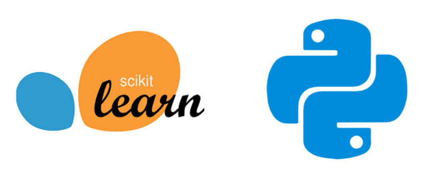

# Useful Scikit-learn methods

<p align="center">

</p>

 Scikit-learn is an opensource machine learning library and has a collection of all the popular machine learning algorithms. It also provides various tools for model fitting, data preprocessing, model selection and evaluation, and many other utilities. It makes these available by providing highly optimized python functions and classes. 

 In this repository, I've put a jupyter notebook that has a collection of useful scikit-learn methods. 

 ## Installation

You can install scikit-learn latest version by using `Anaconda` or `Pip`.

**Anaconda**

```
$ conda install -c conda-forge scikit-learn 
```

**Pip**

```
pip install -U scikit-learn
```

This will install other dependencies as well like `numpy` and `scipy`.

 ## Clone the repository

 ```
 $ git clone https://github.com/ioarun/scikit-learn-notebook.git
 ```

 ## Run the notebook

 ```
 $ jupyter notebook scikit-learn-notebook.ipynb
 ```

 ## Questions?

I'm always up for discussion over machine learning and datascience. You can reach out to me at [](mailto:arun.etc.kumar@gmail.com) or on twitter [](https://www.twitter.com/backpropguy)